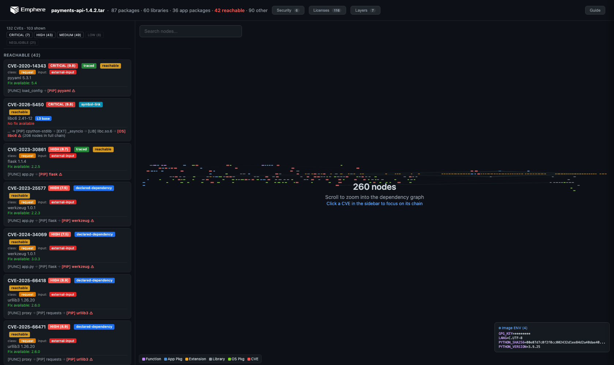

<h1>
  <picture>
    <source media="(prefers-color-scheme: dark)" srcset="assets/deph-icon-light.svg">
    
  </picture>
  &nbsp;deph-action
</h1>

### A vulnerability is a property of your system, not a component.

Unpack your built container image into a dependency graph and see which CVE-affected components are actually in your execution path. What's real versus what's noise.

[](https://github.com/emphereio/deph-action/actions/workflows/ci.yml)
[](LICENSE)

---

<p align="center">
  <a href="https://emphereio.github.io/deph-action/report.html">
    
  </a>
  <br>
  <sub><a href="https://emphereio.github.io/deph-action/report.html">▶ open the live interactive report</a></sub>
</p>

A container image scan lists every CVE present in the image. Most of those affected components are never reached by your application. deph unpacks the built image into a **cross-layer dependency graph** — **application packages → native extensions (`.so`) → OS packages → compiled symbols** — and maps each CVE-affected component to where it sits: reachable from your code, linked by a binary, or just present.

Because it reads the built artifact, deph sees the whole stack, not just your package manifest. A CVE in a native library like `openssl` is tied to the binary that actually links it — not reported as an anonymous OS finding. (App-dependency reachability is one layer of that graph; the native/OS layers are shown as what your binaries link, which most tools don't trace at all.)

deph is not a scanner and does not replace one. It uses Grype's CVE data and adds the dependency graph on top: keep your existing scanning, and get a clear answer on which findings are actually in your execution path.

Run it after the image is built. The verdict is bound to the image digest, so you compute it once and use it anywhere: a PR comment, a job summary, the code-scanning tab, or a release gate.

## What you get

Every run produces a digest-bound verdict that splits the known CVEs three ways (counts are deduped by CVE ID, keeping the strongest tier):

- **in your execution path** — deph found path evidence reaching the affected code.
- **linked / present** — the component is linked or present, but not fully traced.
- **no path found** — present in the image, but deph found no execution path to it. (This is "no path found," **not** a proof of safety — dynamic dispatch in Python/JVM/framework code means absence of a found path is not a guarantee.)

The action surfaces that verdict as a **job summary** (always), a **sticky PR comment** (on pull requests), a machine-readable **`verdict.json`** and **JSON report**, a self-contained **HTML report**, and — opt-in — **SARIF** to the Security tab, a **CycloneDX SBOM**, and a **`fail-on` gate** that fails the job on in-path findings.

📂 **More example reports** — [browse the gallery](https://emphereio.github.io/deph-action/gallery/) of interactive deph scans: `grafana` (26 reachable), `prometheus` (8 reachable), and a demo app. Raw artifacts are in [`examples/`](examples/).

## Measured accuracy

deph's path-finding is **measured against independent oracles, not asserted** — strengths and gaps are both published. Full methodology, provenance, and reproduce commands are maintained with the deph engine.

**Constructed corpus — per-runtime precision / recall.** 36 ground-truth-**by-construction** fixtures (each pinned to a real CVE, built in reachable / dead-import / unused-dep / patched / safe-method variants). Known-answer and synthetic — **not** a real-world rate, but the only place precision *and* recall are both decidable with certainty:

| runtime | precision | recall | reachability resolution |
|---|---|---|---|
| Go | **100%** | **100%** | symbol-level |
| Java | **100%** | **100%** | method-level refinement |
| PHP | **100%** | **100%** | package-level (no safe-method probe yet) |
| Python | **75%** | **100%** | package-level — 1 `safe-method` over-claim |
| npm | **80%** | **100%** | package-level — 1 `safe-method` over-claim |
| **all** | **89.5%** | **100%** | FP=2, FN=0 |

**Recall is 100% across every runtime — no reachable CVE is missed.** The two false positives are the known package-level over-claim: deph flags a package when *any* of its API is called, so a safe call (lodash `_.chunk`, pyyaml `yaml.dump`) over-claims the vulnerable `_.template` / `yaml.load`. Java's method-level refinement dismisses these correctly; npm/Python stay package-level recall-first today (the same fix was measured and rejected for PHP — it introduced false negatives).

**Real images & runtime confirmation:**

| measurement | result | basis & caveat |
|---|---|---|
| Go real-image precision vs `govulncheck` | **83.4%** | 30 real images **incl. stdlib**, same pinned DB; adjudicated vs the Go team's call-graph tool; point-in-time |
| Go real-image recall vs `govulncheck` | **83.8%** | same run (agree 647 / FP 129 / FN 125) |
| Exploitation campaign — vulhub (152 families / 484 scenarios) | **178 confirmed exploitations** / 3,430 attempts | real-world reachability confirmed at breadth; a recall & exploitability floor, not a precision figure |
| Runtime-confirmed — Go, `traefik:v3.0`, eBPF symbol uprobes | **11 stdlib CVEs** moved "installed"→proven-in-path | each observed executing under an HTTP stimulus |
| Runtime-confirmed — PHP `twig` & Node.js `lodash`, in-process oracles | **confirmed in-path** (`FilesystemLoader::findTemplate`, `_.template` observed executing) | Zend Observer / V8 precise-coverage; per-ecosystem precision/recall **adjudication pending** |

Read these as evidence, not marketing: the constructed numbers are correctness on known-answer cases (real-world dead-code and reflection/DI remain documented frontiers, not solved); the per-runtime table is the current cross-ecosystem picture; the ~83/83 is the honest real-world Go picture; recall figures are lower bounds. Real-image **precision/recall is Go-only so far** — there's no `govulncheck`-equivalent reference for the other ecosystems yet. Runtime path-confirmation uses a per-runtime oracle — Go/native: eBPF symbol uprobes; Python: in-process `sys.monitoring`; PHP: in-process Zend Observer; Node.js: in-process V8 precise-coverage — with eBPF the common kernel layer (where one exists) and absence-of-observation never read as "not reachable." The full methodology and reproduce commands are maintained with the deph engine.

<sub>Background: [the lab behind these numbers](https://www.emphere.com/blog/groundzero-isolated-kernel-and-exploit-lab).</sub>

## Usage

Run it **after the image is built**. Build → (test) → **deph-action**.

```yaml
name: deph

on:
  pull_request:
  push:
    branches: [main]

jobs:
  triage:
    runs-on: ubuntu-latest
    permissions:
      contents: read
      pull-requests: write   # sticky PR comment
    steps:
      - uses: actions/checkout@v4

      - name: Build image
        run: docker build -t app:${{ github.sha }} .

      - uses: emphereio/deph-action@v0
        with:
          image: app:${{ github.sha }}
```

The image was built on the runner and lives only in the local Docker daemon, so the action `docker save`s it to a tarball and scans that — deph does not read the daemon directly.

### Bind to a registry digest (recommended for release pipelines)

When you push the image, pass the digest from `docker/build-push-action` so the verdict binds to the strong OCI content digest:

```yaml
      - id: build
        uses: docker/build-push-action@v6
        with:
          push: true
          tags: ghcr.io/acme/app:${{ github.sha }}

      - uses: emphereio/deph-action@v0
        with:
          image: ghcr.io/acme/app@${{ steps.build.outputs.digest }}
          image-digest: ${{ steps.build.outputs.digest }}
```

### Gate a release + publish to the Security tab

```yaml
      - uses: emphereio/deph-action@v0
        with:
          image: ghcr.io/acme/app:${{ github.sha }}
          fail-on: reachable-critical   # fail only on in-path CRITICAL CVEs
          upload-sarif: true            # reachable-only SARIF -> Security tab
        # requires: permissions: { security-events: write }
```

## Inputs

| input | required | default | description |
| --- | --- | --- | --- |
| `image` | yes | | Local image name (auto-saved & scanned) or a registry reference deph pulls. |
| `image-digest` | no | | Digest to bind the verdict to, e.g. `${{ steps.build.outputs.digest }}`. |
| `deph-version` | no | `v0.1.3` | deph release tag to download (from `emphereio/deph-dist`). |
| `deph-token` | no | | Token to download the deph release; falls back to `github.token`. Set a PAT only if the deph repo is private. |
| `severity` | no | | Severity filter passed to deph (e.g. `critical,high`). |
| `vex` | no | | VEX document path(s) for suppression. |
| `probe` | no | `off` | Runtime probe (Linux only): `off` \| `startup` \| `dynamic`. See [Runtime probe](#runtime-probe). |
| `probe-timeout` | no | `30s` | Probe window when `probe` is on. |
| `fail-on` | no | `none` | Gate: `none` \| `any-reachable` \| `reachable-high` \| `reachable-critical`. |
| `upload-sarif` | no | `false` | Upload reachable-only SARIF to code scanning (second scan pass). |
| `upload-sbom` | no | `false` | Emit a CycloneDX SBOM (second scan pass). |
| `comment-on-pr` | no | `auto` | `auto` (comment on PR events) \| `always` \| `off`. |
| `output-directory` | no | `deph-report` | Directory for generated report files. |
| `upload-artifact` | no | `true` | Upload the report directory as a workflow artifact. |
| `artifact-name` | no | `deph-report` | Name of the uploaded artifact. |
| `retention-days` | no | `0` | Days to retain the report artifact (TTL). `0` = repo default; otherwise 1–90. |

## Runtime probe

Off by default. Opt in to add a runtime layer on top of the static reachability:

- **`probe: startup`** runs your image and observes what actually loads at startup (eBPF `openat`/`execve`), so a CVE in a library that never loads can be set aside. Works for **any image**.
- **`probe: dynamic`** also attaches eBPF uprobes to vulnerable functions and drives the entrypoint, flipping CVEs that **execute** to reachable with `evidence: traced`. Function-level confirmation is **Go today**; non-Go images still get the startup observation but not per-function confirmation.

Runtime-confirmed findings flow into `verdict.json`, the report, and the PR comment, marked `evidence: traced`.

**Requirements and safety:**
- **Linux runner with Docker and root.** GitHub-hosted `ubuntu-latest` works out of the box — eBPF needs root, so the action elevates with `sudo` itself and hands file ownership back; you configure nothing. On a runner that can't get root or Docker, the probe is **skipped with a warning and the static results still ship** — the job never fails just because the probe couldn't run.
- **It runs your image.** The probe `docker run`s the target (dropped capabilities, CPU/memory/pid limits) on the ephemeral runner. Point it at **your own builds**, not untrusted third-party images.
- The probe runs deph (a signed, attestation-verified binary) as root, so if you're security-conscious this is extra reason to pin the action by commit SHA rather than `@v0`.

```yaml
- uses: emphereio/deph-action@v0
  with:
    image: my-app:${{ github.sha }}   # your built image
    probe: dynamic                    # runtime confirmation (Go: per-function; others: load observation)
```

## Outputs

| output | description |
| --- | --- |
| `report-json` | Path to the deph JSON report (source of truth). |
| `verdict-json` | Path to the digest-bound verdict. |
| `summary-markdown` | Path to the Markdown summary. |
| `report-html` | Path to the self-contained HTML report. |
| `sarif` | Path to the SARIF file (when `upload-sarif` is enabled). |
| `sbom-cyclonedx` | Path to the CycloneDX SBOM (when `upload-sbom` is enabled). |
| `image-digest` | The digest the verdict is bound to. |
| `total-cves` | Distinct known CVEs found (deduped by CVE ID). |
| `in-path-cves` | CVEs deph found in the execution path. |
| `linked-cves` | CVEs linked/present but not fully traced. |
| `not-found-in-path-cves` | CVEs present but with no execution path found by deph. |
| `gate-tripped` | `true` when the `fail-on` policy matched. |
| `deph-exit-code` | deph scan exit code (0 clean, 1 findings, 2 error). |

## The verdict

`verdict.json` is the canonical, digest-bound product (schema in [`schema/deph-verdict.schema.json`](schema/deph-verdict.schema.json)). It records the image ref + resolved digest and **how strong that binding is** (`digest_kind`, strongest first):

- `provided` — a digest you passed in via `image-digest`.
- `repo-digest` — a registry content digest (from a `@sha256:` ref or `RepoDigests`).
- `tar-sha256` — sha256 of the exact saved tarball that was scanned (for local-only builds).
- `config-id` — the local image config ID (weakest).

Alongside the digest it carries the three-way `summary`, the in-path CVE list (severity, CVSS, EPSS, KEV, fix, evidence, call chain, priority), the `gate` result, and paths to every artifact. SARIF is opt-in and reachable-only by design — container CVE locations render awkwardly in code scanning, so `verdict.json` is the source of truth, not the SARIF.

## How the image reaches deph

deph does not read the local Docker daemon. The action handles both cases automatically:

- **Local image** (built on the runner, not pushed) → `docker save` to a tarball → scan the tarball. The digest binds via `tar-sha256` (or `config-id`) unless you pass `image-digest`.
- **Registry reference** → deph pulls it directly (no daemon needed), honoring `~/.docker/config.json` / credential helpers. For a plain tag, the action resolves the registry content digest (`repo-digest`) via `docker buildx imagetools inspect`, `crane`, or `skopeo` — whichever is present. Pass a `@sha256:` ref or `image-digest` to guarantee the binding without a resolver.

The deph binary is downloaded from the public `emphereio/deph-dist` releases and **verified against the published `checksums.txt` and Sigstore build provenance** before running. The Grype vulnerability DB (~50 MB) is cached between runs.

## Host the report on your own GitHub Pages

The `report.html` is a **fully self-contained, single-file** interactive graph (no external/CDN loads, with a strict Content-Security-Policy), so it's safe to host as-is. The action exposes it as the `report-html` output — wire that into your own Pages deploy on `main`:

```yaml
permissions:
  contents: read
  pages: write
  id-token: write
steps:
  - run: docker build -t app:${{ github.sha }} .
  - id: deph
    uses: emphereio/deph-action@v0
    with:
      image: app:${{ github.sha }}
  - run: mkdir -p site && cp "${{ steps.deph.outputs.report-html }}" site/index.html
  - uses: actions/upload-pages-artifact@v3
    with: { path: site }
  - uses: actions/deploy-pages@v4
```

You stay in control of where, how, retention, and which branch publishes — the action never deploys to your Pages on its own. For the workflow **artifact** (not Pages), set `retention-days` to control its TTL.

## Permissions

| feature | permission |
| --- | --- |
| base scan + artifact | `contents: read` |
| sticky PR comment | `pull-requests: write` |
| `upload-sarif: true` | `security-events: write` |

## Development

```bash
./scripts/validate.sh        # offline self-test: shell syntax + verdict transform + schema
```

`scripts/validate.sh` runs the verdict transform against [`testdata/sample-deph-report.json`](testdata/sample-deph-report.json) and validates the emitted `verdict.json` against the schema — no deph download or scan required.

## Roadmap

- **AI triage (bring your own key)** — explain and recommend action over the *in-path* set only.
- **Attestation / signing** — `cosign attest` the verdict + SBOM to the image digest, so release gates and admission controllers consume it without rescanning.
- **Single-pass multi-format** — emit JSON + SARIF + SBOM + HTML from one deph scan.

## License

deph-action (this repository — the wrapper scripts and action definition) is licensed under [MIT](LICENSE).

The **deph engine binary** that the action downloads is a separate, **source-available** product licensed under the **Functional Source License 1.1 (FSL-1.1-ALv2)**: **free to use for any purpose — including commercial and enterprise CI/CD, internal use, and production.** The only restriction is you may not use it to build a **competing** product or service. Each release automatically becomes **Apache 2.0** two years after it ships. See the binary's bundled `LICENSE`.

## Security

Generated artifacts may contain private repository or image data. See [SECURITY.md](SECURITY.md).
